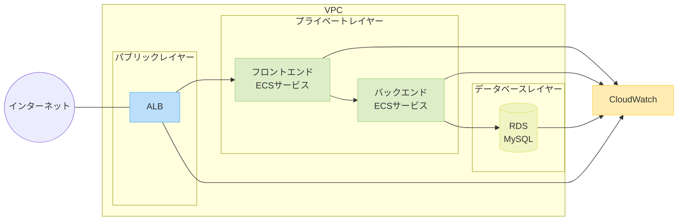
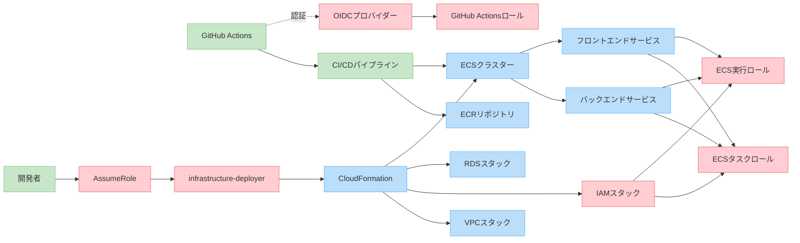

# AWS ECS デプロイ設定

本プロジェクトの AWS ECS（Elastic Container Service）へのデプロイに関する情報を記載しています。

## 目次

- [アーキテクチャ概要](#アーキテクチャ概要)
- [システムアーキテクチャ図](#システムアーキテクチャ図)
- [AWS 環境構成図](#aws環境構成図)
- [必要な AWS リソース](#必要な-aws-リソース)
- [デプロイフロー](#デプロイフロー)
- [初期設定](#初期設定)
- [IAM 運用方針](#iam-運用方針)
- [CloudFormation によるデプロイ](#cloudformation-によるデプロイ)
- [CloudFormation によって作成されるリソース](#cloudformation-によって作成されるリソース)
- [環境変数の設定](#環境変数の設定)
- [トラブルシューティング](#トラブルシューティング)

## アーキテクチャ概要

本プロジェクトは以下の AWS サービスを利用しています：

- **ECR (Elastic Container Registry)**: Docker イメージの保存
- **ECS (Elastic Container Service)**: コンテナの実行環境
  - Fargate を使用（サーバーレスコンテナ実行環境）
- **ALB (Application Load Balancer)**: トラフィックの分散
- **RDS (Relational Database Service)**: PostgreSQL データベース
- **S3**: 静的ファイルの保存
- **CloudWatch**: ログとメトリクスの収集
- **IAM**: 権限管理

## システムアーキテクチャ図



この図は、AWS 内のシステムコンポーネントがどのように接続されているかを示しています。インターネットからのトラフィックはロードバランサー（ALB）を通じて、フロントエンドとバックエンドの ECS サービスに到達し、データは RDS に格納されます。すべてのコンポーネントはログを CloudWatch に送信しています。

## AWS 環境構成図



上記の図は、AWS 環境の構成全体とデプロイフローを表しています。「開発者」が`infrastructure-deployer`ロールを使用して CloudFormation でインフラをデプロイし、その後 CI/CD パイプラインが各サービスのデプロイを行う流れを示しています。このリソース間の関係性の理解は、AWS リソース管理において重要です。

## 必要な AWS リソース

### ECR リポジトリ

- `book-management-frontend`: フロントエンドの Docker イメージ用
- `book-management-backend`: バックエンドの Docker イメージ用

### ECS リソース

- **クラスター**: `book-management-cluster`
- **サービス**:
  - `book-management-frontend-service`
  - `book-management-backend-service`
- **タスク定義**:
  - `.aws/task-definitions/frontend.json`
  - `.aws/task-definitions/backend.json`

### その他のリソース

- **VPC** と **サブネット**
- **セキュリティグループ**
- **IAM ロール**
- **RDS インスタンス**
- **ALB**
- **S3 バケット**

## デプロイフロー

GitHub Actions を使用して、以下の流れでデプロイを行います：

1. `main`ブランチへのプッシュをトリガーに、ワークフローが開始
2. テストの実行
3. Docker イメージのビルド
4. ECR へのイメージのプッシュ
5. ECS タスク定義の更新（新しいイメージを参照）
6. ECS サービスの更新（ローリングデプロイによるゼロダウンタイム）

詳細なフローは `.github/workflows/deploy-ecs-production.yml` を参照してください。

## 初期設定

### AWS 認証情報を GitHub シークレットとして設定

CI/CD パイプラインで AWS リソースにアクセスするには、以下の GitHub シークレットを設定する必要があります：

1. GitHub リポジトリの「Settings」→「Secrets and variables」→「Actions」に移動
2. 「New repository secret」をクリックし、以下のシークレットを追加：

#### AWS 認証方法

**IAM ロールを使用（OpenID Connect）**

- `AWS_ROLE_TO_ASSUME`: GitHub Actions が引き受ける IAM ロールの ARN
  - 例: `arn:aws:iam::<ACCOUNT_ID>:role/github-actions-role`
- このオプションを使用する場合は、AWS 側で IAM OIDC Provider を設定する必要があります
- 詳細は[GitHub Actions からの OIDC 認証](https://docs.github.com/ja/actions/deployment/security-hardening-your-deployments/configuring-openid-connect-in-amazon-web-services)を参照
- セキュリティ上のメリットと長期的な認証情報管理の手間を省けるため、**強く推奨される方法**です

**注意**: 長期的なアクセスキー（IAM ユーザー）は、セキュリティリスクが高いため非推奨です。必ず OIDC 認証を使用してください。

#### その他の設定値

- `AWS_REGION`: 使用する AWS リージョン（例：`ap-northeast-1`）
- `ECR_REPOSITORY_FRONTEND`: フロントエンド ECR リポジトリ名
- `ECR_REPOSITORY_BACKEND`: バックエンド ECR リポジトリ名
- `ECS_CLUSTER`: ECS クラスター名
- `ECS_SERVICE_FRONTEND`: フロントエンド ECS サービス名
- `ECS_SERVICE_BACKEND`: バックエンド ECS サービス名

これらの認証情報は、GitHub Actions ワークフローファイル内で環境変数として利用され、AWS リソースへのアクセスに使用されます。

**重要**: IAM 認証情報は機密情報です。GitHub シークレットとして安全に保存し、コードやコミットメッセージに記載しないでください。セキュリティのベストプラクティスとして、IAM ロールベースの OIDC 認証を使用してください。

## IAM 運用方針

本プロジェクトの AWS リソース管理においては、以下の IAM 運用方針を採用しています。

### インフラデプロイ用ロール

**インフラデプロイ（CloudFormation 等）には、組織共通の「infrastructure-deployer」ロール（または同等の権限を持つロール）を AssumeRole して使用することが必須です。**

- このロールは汎用的なインフラ構築用ロールであり、プロジェクト固有ではありません。
- インフラデプロイ用ロールが未作成の場合は、管理者権限で作成してください。
  - テンプレート例: `.aws/cloudformation/infrastructure-deployer-role.yaml`
- 個人 IAM ユーザーから`AssumeRole`で一時的な認証情報を取得し、IaC 操作を行います。
- 長期的なアクセスキーは使用せず、常に一時的な認証情報を使用してください。

```bash
# AssumeRoleで一時的な認証情報を取得する例
aws sts assume-role \
  --role-arn arn:aws:iam::<ACCOUNT_ID>:role/infrastructure-deployer \
  --role-session-name <YOUR_NAME>-deployment-session \
  --duration-seconds 3600

# 取得した認証情報を環境変数にセット
export AWS_ACCESS_KEY_ID=<取得した一時的なアクセスキー>
export AWS_SECRET_ACCESS_KEY=<取得した一時的なシークレットキー>
export AWS_SESSION_TOKEN=<取得したセッショントークン>

# これ以降のAWS CLIコマンドは、一時的な認証情報を使用して実行される
```

### 便利な一括設定方法（推奨）

以下のワンライナーコマンドを使用すると、一度に環境変数をセットできます：

```bash
eval $(aws sts assume-role \
  --role-arn "arn:aws:iam::<ACCOUNT_ID>:role/infrastructure-deployer" \
  --role-session-name "DeploySession" \
  --duration-seconds 3600 \
  --query 'Credentials.[
    "export AWS_ACCESS_KEY_ID=\"" + AccessKeyId + "\"",
    "export AWS_SECRET_ACCESS_KEY=\"" + SecretAccessKey + "\"",
    "export AWS_SESSION_TOKEN=\"" + SessionToken + "\""
  ]' \
  --output text)
```

**注意**: 認証情報の有効期限（上記の例では 1 時間=3600 秒）が切れた場合は、再度コマンドを実行して新しい認証情報を取得する必要があります。

### アプリケーション固有の IAM リソース

本プロジェクトでは、以下のアプリケーション固有の IAM リソースを使用します。これらのリソースは CloudFormation テンプレートで定義されており、`infrastructure-deployer`ロールを使用してデプロイします。

- **ECS タスク実行ロール**

  - 名前: `book-management-ecs-task-execution-role`
  - 用途: ECS タスクが ECR からのイメージプルや CloudWatch へのログ出力を行うために使用
  - ポリシー: `AmazonECSTaskExecutionRolePolicy` + SecretsManager と SSM へのアクセス権限

- **バックエンドタスクロール**

  - 名前: `book-management-backend-task-role`
  - 用途: バックエンドアプリケーションが RDS, S3, SES などにアクセスするために使用
  - ポリシー: アプリケーション固有の AWS リソースにアクセスする権限

- **フロントエンドタスクロール**
  - 名前: `book-management-frontend-task-role`
  - 用途: フロントエンドアプリケーションが S3, CloudFront などにアクセスするために使用
  - ポリシー: 限定的な S3 バケットへのアクセス権限

### CI/CD パイプライン用認証

CI/CD パイプライン（GitHub Actions）から AWS リソースへのアクセスには、GitHub Actions の OIDC 認証を使用します。

```bash
# OIDCプロバイダーの作成

# 証明書サムプリントの取得
# 以下のコマンドで最新のサムプリントを取得できます
THUMBPRINT=$(openssl s_client -servername token.actions.githubusercontent.com -showcerts -connect token.actions.githubusercontent.com:443 </dev/null 2>/dev/null | openssl x509 -fingerprint -sha1 -noout | sed 's/://g' | awk -F= '{print tolower($2)}')
echo $THUMBPRINT

# または、以下の値を使用することも可能です（定期的に更新されるため、最新の値を確認してください）
# THUMBPRINT="6938fd4d98bab03faadb97b34396831e3780aea1"

# OIDCプロバイダーの作成
aws iam create-open-id-connect-provider \
  --url https://token.actions.githubusercontent.com \
  --client-id-list sts.amazonaws.com \
  --thumbprint-list $THUMBPRINT

# GitHubリポジトリに制限されたIAMロールの作成

# 必要な変数を設定
# AWSアカウントIDを取得
ACCOUNT_ID=$(aws sts get-caller-identity --query "Account" --output text)
echo "AWSアカウントID: $ACCOUNT_ID"

# GitHubの情報を設定
# 例: https://github.com/your-username/book-management の場合
GITHUB_ORG="your-username"  # GitHubのユーザー名または組織名
REPO_NAME="book-management"  # リポジトリ名

# ポリシードキュメントを作成
cat > github-actions-role-policy.json << EOF
{
  "Version": "2012-10-17",
  "Statement": [
    {
      "Effect": "Allow",
      "Principal": {
        "Federated": "arn:aws:iam::${ACCOUNT_ID}:oidc-provider/token.actions.githubusercontent.com"
      },
      "Action": "sts:AssumeRoleWithWebIdentity",
      "Condition": {
        "StringEquals": {
          "token.actions.githubusercontent.com:aud": "sts.amazonaws.com"
        },
        "StringLike": {
          "token.actions.githubusercontent.com:sub": "repo:${GITHUB_ORG}/${REPO_NAME}:*"
        }
      }
    }
  ]
}
EOF

# GitHubリポジトリに制限されたIAMロールの作成
aws iam create-role \
  --role-name book-management-github-actions-role \
  --assume-role-policy-document file://github-actions-role-policy.json \
  --max-session-duration 3600 \
  --description "Role for GitHub Actions to deploy book-management project"

# ロールにポリシーを添付
aws iam attach-role-policy \
  --role-name book-management-github-actions-role \
  --policy-arn arn:aws:iam::aws:policy/AmazonECR-FullAccess

aws iam attach-role-policy \
  --role-name book-management-github-actions-role \
  --policy-arn arn:aws:iam::aws:policy/AmazonECS-FullAccess
```

OIDC 認証を使用すると、以下のメリットがあります：

- アクセスキーを管理する必要がない
- 一時的な認証情報のみを使用するため、セキュリティリスクが低減
- GitHub Actions のワークフローが特定のリポジトリ・ブランチに制限可能

### IAM セキュリティのベストプラクティス

1. **最小権限の原則を適用する**

   - 各ロールには必要最小限の権限のみを付与
   - ワイルドカード（\*）の使用を最小限に抑える
   - 特定のリソース ARN を指定して権限を制限

2. **IAM ポリシーのレビューと監査**

   - AWS IAM Access Analyzer を使用してポリシーを定期的に監査
   - 使用されていない権限を特定し、削除

3. **MFA の有効化**

   - 特に管理者アカウントには MFA（多要素認証）を必須に
   - プログラムによるアクセスには一時的な認証情報の使用を推奨

4. **アクセスキーのセキュリティ**

   - アクセスキーを定期的にローテーション
   - アクセスキーをソースコードにハードコーディングしない
   - 特に本番環境のアクセスキーは厳重に管理

5. **AWS 認証情報レポートの定期確認**

   ```bash
   aws iam generate-credential-report
   aws iam get-credential-report
   ```

6. **権限昇格の制限**

   - 権限昇格パスを特定し、制限するポリシーを実装
   - サービスロールには特定のサービスのみが引き受け可能な信頼ポリシーを設定

7. **CI/CD パイプラインでの OIDC 認証の使用**

   - 長期的なアクセスキーの代わりに GitHub Actions の OpenID Connect (OIDC)を使用
   - AWS に OIDC プロバイダーと IAM ロールを設定：

   ```bash
   # OIDCプロバイダーの作成
   aws iam create-open-id-connect-provider \
     --url https://token.actions.githubusercontent.com \
     --client-id-list sts.amazonaws.com \
     --thumbprint-list <GitHub Actions OIDCプロバイダーの証明書サムプリント>

   # GitHubリポジトリに制限されたIAMロールの作成
   aws iam create-role \
     --role-name book-management-github-actions-role \
     --assume-role-policy-document '{
       "Version": "2012-10-17",
       "Statement": [
         {
           "Effect": "Allow",
           "Principal": {
             "Federated": "arn:aws:iam::<ACCOUNT_ID>:oidc-provider/token.actions.githubusercontent.com"
           },
           "Action": "sts:AssumeRoleWithWebIdentity",
           "Condition": {
             "StringEquals": {
               "token.actions.githubusercontent.com:aud": "sts.amazonaws.com"
             },
             "StringLike": {
               "token.actions.githubusercontent.com:sub": "repo:<GITHUB_ORGANIZATION>/<REPOSITORY_NAME>:*"
             }
           }
         }
       ]
     }'
   ```

## CloudFormation によるデプロイ

CloudFormation を使用して、インフラストラクチャをコードとして管理し、デプロイします。

### デプロイ準備

1. AWS CLI をインストールし、設定する

   ```bash
   # AWS CLIのインストール（macOS）
   brew install awscli

   # AWS CLIの設定
   aws configure
   ```

2. `infrastructure-deployer`ロール（または同等の権限を持つロール）を AssumeRole する

   ```bash
   # AssumeRoleで一時的な認証情報を取得
   aws sts assume-role \
     --role-arn arn:aws:iam::<ACCOUNT_ID>:role/infrastructure-deployer \
     --role-session-name deployment-session

   # 環境変数を設定（具体的な値は上記コマンドの出力から取得）
   export AWS_ACCESS_KEY_ID=<Credentials.AccessKeyId>
   export AWS_SECRET_ACCESS_KEY=<Credentials.SecretAccessKey>
   export AWS_SESSION_TOKEN=<Credentials.SessionToken>
   ```

3. 必要なパラメータを準備する
   - スタック名
   - 環境名（dev, staging, prod）
   - リージョン
   - その他スタック固有のパラメータ

### スタックのデプロイ順序

スタック間の依存関係があるため、以下の順序でデプロイする必要があります：

1. VPC（ネットワーク）
2. ECR（コンテナレジストリ）
3. RDS（データベース）
4. S3（静的ファイル）
5. ALB（ロードバランサー）
6. ECS（コンテナサービス）

### スタックのデプロイコマンド

以下のコマンドは、すべて`infrastructure-deployer`ロール（または同等の権限を持つロール）を AssumeRole した状態で実行してください。

#### VPC スタックのデプロイ

```bash
aws cloudformation deploy \
  --template-file .aws/cloudformation/vpc.yaml \
  --stack-name book-management-vpc \
  --parameter-overrides \
    Environment=dev \
    ProjectName=book-management \
    VpcCidr=10.0.0.0/16 \
    PublicSubnet1Cidr=10.0.1.0/24 \
    PublicSubnet2Cidr=10.0.2.0/24 \
    PrivateSubnet1Cidr=10.0.3.0/24 \
    PrivateSubnet2Cidr=10.0.4.0/24
```

#### ECR スタックのデプロイ

```bash
aws cloudformation deploy \
  --template-file .aws/cloudformation/ecr.yaml \
  --stack-name book-management-ecr \
  --parameter-overrides \
    Environment=dev \
    ProjectName=book-management
```

#### RDS スタックのデプロイ

```bash
aws cloudformation deploy \
  --template-file .aws/cloudformation/rds.yaml \
  --stack-name book-management-rds \
  --parameter-overrides \
    Environment=dev \
    ProjectName=book-management \
    VpcStackName=book-management-vpc \
    DBInstanceClass=db.t3.micro \
    DBName=bookmanagement \
    DBUsername=admin \
    DBPassword=<データベースパスワード>
```

#### ALB スタックのデプロイ

```bash
aws cloudformation deploy \
  --template-file .aws/cloudformation/alb.yaml \
  --stack-name book-management-alb \
  --parameter-overrides \
    Environment=dev \
    ProjectName=book-management \
    VpcStackName=book-management-vpc \
    CertificateArn=<SSL証明書のARN>
```

#### ECS スタックのデプロイ

```bash
aws cloudformation deploy \
  --template-file .aws/cloudformation/ecs.yaml \
  --stack-name book-management-ecs \
  --capabilities CAPABILITY_NAMED_IAM \
  --parameter-overrides \
    Environment=dev \
    ProjectName=book-management \
    VpcStackName=book-management-vpc \
    EcrStackName=book-management-ecr \
    RdsStackName=book-management-rds \
    AlbStackName=book-management-alb
```

`CAPABILITY_NAMED_IAM`フラグは、ECS スタックが`book-management-ecs-task-execution-role`、`book-management-backend-task-role`、`book-management-frontend-task-role`などの IAM リソースを作成するために必要です。

### スタックの更新と削除

既存のスタックを更新する場合は、同じデプロイコマンドを使用します。CloudFormation は変更のあるリソースのみを更新します。

不要になったスタックを削除するには、以下のコマンドを使用します：

```bash
aws cloudformation delete-stack --stack-name <スタック名>
```

**注意**: スタックを削除すると、そのスタックで作成されたすべてのリソースも削除されます。本番環境では十分注意してください。

また、依存関係があるため、削除は作成と逆の順序で行います：

1. ECS
2. ALB
3. S3
4. RDS
5. ECR
6. VPC
7. IAM

## CloudFormation によって作成されるリソース

CloudFormation によるデプロイを完了すると、以下の AWS リソースが作成されます。各スタックごとに作成されるリソースの詳細を示します。

### VPC スタック (`book-management-vpc`)

- **VPC**

  - CIDR: 10.0.0.0/16
  - DNS サポート: 有効
  - DNS ホスト名: 有効

- **パブリックサブネット**

  - 数: 2 つのアベイラビリティゾーンに分散
  - CIDR: 10.0.1.0/24, 10.0.2.0/24
  - 用途: ALB、NAT Gateway などのパブリックサービスをホスト

- **プライベートサブネット**

  - 数: 2 つのアベイラビリティゾーンに分散
  - CIDR: 10.0.3.0/24, 10.0.4.0/24
  - 用途: ECS タスク、RDS インスタンスなどのプライベートリソースをホスト

- **インターネットゲートウェイ**

  - 用途: VPC とインターネット間の通信を可能にする

- **NAT ゲートウェイ**

  - 数: 2 つのパブリックサブネットにそれぞれ配置
  - 用途: プライベートサブネットからインターネットへの送信トラフィックを許可

- **ルートテーブル**

  - パブリックルートテーブル: インターネットゲートウェイ経由でのインターネットアクセス
  - プライベートルートテーブル: NAT ゲートウェイ経由でのインターネットアクセス

- **セキュリティグループ**
  - ALB セキュリティグループ: HTTP/HTTPS トラフィックを許可
  - ECS セキュリティグループ: ALB からのトラフィックのみを許可
  - RDS セキュリティグループ: ECS からのトラフィックのみを許可

### ECR スタック (`book-management-ecr`)

- **ECR リポジトリ**
  - `book-management-backend`: バックエンドアプリケーション用 Docker イメージリポジトリ
  - `book-management-frontend`: フロントエンドアプリケーション用 Docker イメージリポジトリ
  - ライフサイクルポリシー: 30 日以上経過した未使用イメージを自動削除

### RDS スタック (`book-management-rds`)

- **DB サブネットグループ**

  - 用途: 複数のアベイラビリティゾーンにわたる RDS デプロイを可能にする
  - サブネット: プライベートサブネット

- **RDS PostgreSQL インスタンス**
  - インスタンスクラス: `db.t3.micro`（開発環境）または `db.t3.small`（本番環境）
  - ストレージ: 20GB（自動スケーリング有効）
  - マルチ AZ: 開発環境では無効、本番環境では有効
  - バックアップ保持期間: 7 日間
  - メンテナンスウィンドウ: 週次で自動設定
  - セキュリティ: プライベートサブネットに配置、ECS からのみアクセス可能

### S3 スタック (`book-management-s3`)

- **S3 バケット**
  - `book-management-static-assets-<environment>`: 静的アセット（画像、CSS、JS）用
  - バージョニング: 有効
  - ライフサイクルポリシー: 古いバージョンを 30 日後に低頻度アクセス層へ移動、90 日後に削除
  - 暗号化: S3 マネージドキー（SSE-S3）

### ALB スタック (`book-management-alb`)

- **アプリケーションロードバランサー**

  - 名前: `book-management-alb-<environment>`
  - タイプ: インターネット向け
  - サブネット: パブリックサブネット
  - セキュリティグループ: ALB セキュリティグループ

- **ターゲットグループ**

  - `book-management-frontend-tg`: フロントエンドサービス用、ポート 80
  - `book-management-backend-tg`: バックエンドサービス用、ポート 8000
  - ヘルスチェック: `/health` エンドポイントに 30 秒ごとにリクエスト

- **リスナー**
  - HTTP:80: HTTPS にリダイレクト
  - HTTPS:443: パスベースルーティング
    - `/api/*`: バックエンドターゲットグループへ
    - `/*`: フロントエンドターゲットグループへ

### ECS スタック (`book-management-ecs`)

- **ECS クラスター**

  - 名前: `book-management-cluster-<environment>`
  - キャパシティプロバイダー: Fargate

- **ECS サービス（バックエンド）**

  - 名前: `book-management-backend-service`
  - タスク数: 2（本番環境）
  - プラットフォームバージョン: LATEST
  - ネットワーク: プライベートサブネット、ECS セキュリティグループ
  - ロードバランサー: ALB のバックエンドターゲットグループに接続
  - 自動スケーリング: CPU 使用率 70%、メモリ使用率 70%でスケールアウト

- **ECS サービス（フロントエンド）**

  - 名前: `book-management-frontend-service`
  - タスク数: 2（本番環境）
  - プラットフォームバージョン: LATEST
  - ネットワーク: プライベートサブネット、ECS セキュリティグループ
  - ロードバランサー: ALB のフロントエンドターゲットグループに接続
  - 自動スケーリング: CPU 使用率 70%でスケールアウト

- **ECS タスク定義（バックエンド）**

  - CPU: 0.5 vCPU
  - メモリ: 1GB
  - コンテナ: バックエンドアプリケーション
  - 環境変数: DB 接続情報、API キーなど（SecretsManager から取得）

- **ECS タスク定義（フロントエンド）**
  - CPU: 0.25 vCPU
  - メモリ: 0.5GB
  - コンテナ: フロントエンドアプリケーション
  - 環境変数: API_URL、NODE_ENV（パラメータストアから取得）

### 監視リソース

- **CloudWatch ロググループ**

  - `/aws/ecs/book-management-backend`: バックエンドログ
  - `/aws/ecs/book-management-frontend`: フロントエンドログ
  - 保持期間: 30 日

- **CloudWatch アラーム**
  - CPU 使用率アラーム: 80%以上が 5 分間継続した場合に通知
  - メモリ使用率アラーム: 80%以上が 5 分間継続した場合に通知
  - ECS サービスの異常: ヘルスチェックに 2 回以上失敗した場合に通知

## 環境変数の設定

### バックエンドタスク

バックエンドのタスク定義には、以下の環境変数を設定する必要があります：

```json
"environment": [
  { "name": "APP_ENV", "value": "production" },
  { "name": "APP_DEBUG", "value": "false" },
  { "name": "DB_CONNECTION", "value": "pgsql" },
  { "name": "DB_HOST", "value": "YOUR_RDS_ENDPOINT" },
  { "name": "DB_PORT", "value": "5432" },
  { "name": "DB_DATABASE", "value": "book_management" },
  { "name": "DB_USERNAME", "value": "username" },
  { "name": "CACHE_DRIVER", "value": "redis" },
  { "name": "SESSION_DRIVER", "value": "redis" },
  { "name": "REDIS_HOST", "value": "YOUR_REDIS_ENDPOINT" }
]
```

**注意**: パスワードなどの機密情報は、AWS Secrets Manager を使用して管理することを推奨します。

### フロントエンドタスク

フロントエンドのタスク定義には、以下の環境変数を設定する必要があります：

```json
"environment": [
  { "name": "API_URL", "value": "https://api.yourdomain.com" },
  { "name": "NODE_ENV", "value": "production" }
]
```

## トラブルシューティング

### よくある問題と解決策

1. **デプロイ失敗**

   - CloudWatch ログを確認して、エラーの詳細を確認してください
   - GitHub Actions のログも確認してください

2. **コンテナの起動失敗**

   - ヘルスチェックの設定を確認してください
   - 必要な環境変数が正しく設定されているか確認してください

3. **データベース接続エラー**

   - セキュリティグループの設定を確認してください
   - データベースの認証情報が正しいか確認してください

4. **ロードバランサーのエラー**
   - ターゲットグループの設定を確認してください
   - ヘルスチェックのパスが正しいか確認してください

### サポートリソース

- [AWS ECS ドキュメント](https://docs.aws.amazon.com/ecs/)
- [AWS ECR ドキュメント](https://docs.aws.amazon.com/ecr/)
- [AWS CloudFormation ドキュメント](https://docs.aws.amazon.com/cloudformation/)
- [GitHub Actions ドキュメント](https://docs.github.com/actions)
