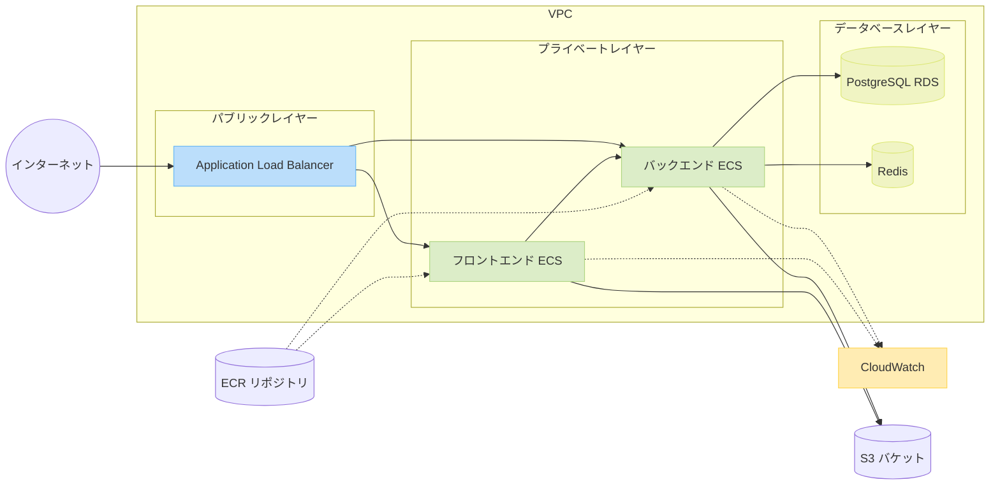
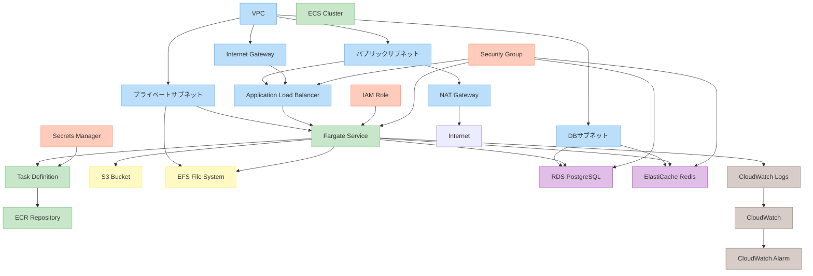

# AWS ECS デプロイ設定

本プロジェクトの AWS ECS（Elastic Container Service）へのデプロイに関する情報を記載しています。

## 目次

- [アーキテクチャ概要](#アーキテクチャ概要)
- [システムアーキテクチャ図](#システムアーキテクチャ図)
- [AWS 環境構成図](#aws環境構成図)
- [必要な AWS リソース](#必要な-aws-リソース)
- [デプロイフロー](#デプロイフロー)
- [初期設定](#初期設定)
  - [IAM 運用方針](#iam-運用方針)
  - [infrastructure-deployer ロールの設定](#infrastructure-deployer-ロールの設定)
  - [CloudFormation によるデプロイ](#cloudformation-によるデプロイ)
    - [作成されるリソース](#作成されるリソース)
  - [GitHub Actions 用 IAM ロールの作成](#github-actions-用-iam-ロールの作成)
- [GitHub リポジトリの設定](#github-リポジトリの設定)
  - [AWS 認証情報を GitHub シークレットとして設定](#aws-認証情報を-github-シークレットとして設定)
  - [その他の設定値](#その他の設定値)
- [環境変数の設定](#環境変数の設定)
- [トラブルシューティング](#トラブルシューティング)

## アーキテクチャ概要

本プロジェクトは以下の AWS サービスを利用しています：

- **ECR (Elastic Container Registry)**: Docker イメージの保存
- **ECS (Elastic Container Service)**: コンテナの実行環境
  - Fargate を使用（サーバーレスコンテナ実行環境）
- **ALB (Application Load Balancer)**: トラフィックの分散
- **RDS (Relational Database Service)**: PostgreSQL データベース
- **S3**: 静的ファイルの保存
- **CloudWatch**: ログとメトリクスの収集
- **IAM**: 権限管理

## システムアーキテクチャ図



## AWS 環境構成図



## 必要な AWS リソース

本プロジェクトでは、以下の AWS リソースを使用します。各リソースは CloudFormation テンプレートを使用して作成されます。

- **VPC およびネットワーク**

  - VPC、サブネット、ルートテーブル、ゲートウェイ
  - セキュリティグループ

- **コンテナ基盤**

  - ECR リポジトリ
  - ECS クラスター
  - タスク定義
  - サービス

- **ロードバランサー**

  - ALB
  - ターゲットグループ
  - リスナールール

- **データベース**

  - RDS PostgreSQL データベース
  - ElastiCache Redis クラスター

- **ストレージ**

  - S3 バケット

- **IAM リソース**
  - タスク実行ロール
  - タスクロール

## デプロイフロー

GitHub Actions を使用して、以下の流れでデプロイを行います：

1. `main`ブランチへのプッシュをトリガーに、ワークフローが開始
2. テストの実行
3. Docker イメージのビルド
4. ECR へのイメージのプッシュ
5. ECS タスク定義の更新（新しいイメージを参照）
6. ECS サービスの更新（ローリングデプロイによるゼロダウンタイム）

詳細なフローは `.github/workflows/deploy-ecs-production.yml` を参照してください。

## 初期設定

### IAM 運用方針

本プロジェクトの AWS リソース管理においては、以下の IAM 運用方針を採用しています。

#### インフラデプロイ用ロール

**インフラデプロイ（CloudFormation 等）には、組織共通の「infrastructure-deployer」ロール（または同等の権限を持つロール）を AssumeRole して使用することが必須です。**

- このロールは汎用的なインフラ構築用ロールであり、プロジェクト固有ではありません。

#### CI/CD 用ロール

**GitHub Actions からの AWS リソースアクセスには、組織共通の「github-actions-role」（または同等の権限を持つロール）を使用することを推奨します。**

- このロールは GitHub Actions からの AWS 操作用の汎用的なロールであり、複数プロジェクトで共有できます。
- 長期的な認証情報（アクセスキーなど）を使用せず、GitHub OIDC（OpenID Connect）を使用した一時的なクレデンシャルを使用します。

### infrastructure-deployer ロールの設定

**このロールはインフラ構築（CloudFormation）に必要です。すでに組織内で作成済みの場合は、一時的認証情報の取得のみ行ってください。**

#### ロールが存在しない場合の作成手順

このロールがまだ作成されていない場合は、管理者権限を持つユーザーで以下の手順を実行してください。

```bash
# インフラデプロイ用ロールの作成
aws iam create-role \
  --role-name infrastructure-deployer \
  --assume-role-policy-document file://infrastructure-deployer-trust-policy.json

# 必要なポリシーのアタッチ（例）
aws iam attach-role-policy \
  --role-name infrastructure-deployer \
  --policy-arn arn:aws:iam::aws:policy/AdministratorAccess
```

#### 一時的認証情報の取得

インフラデプロイをローカルから行う場合は、以下の方法で一時的な認証情報を取得して使用します：

```bash
# 一括設定方法（推奨）
aws sts assume-role \
  --role-arn "arn:aws:iam::<ACCOUNT_ID>:role/infrastructure-deployer" \
  --role-session-name "DeploySession" \
  --duration-seconds 3600 \
  --output json | jq -r '.Credentials | "export AWS_ACCESS_KEY_ID=\(.AccessKeyId)\nexport AWS_SECRET_ACCESS_KEY=\(.SecretAccessKey)\nexport AWS_SESSION_TOKEN=\(.SessionToken)"' | source /dev/stdin
```

**注意**: 認証情報の有効期限（上記の例では 1 時間=3600 秒）が切れた場合は、再度コマンドを実行して新しい認証情報を取得する必要があります。

一時的認証情報を取得したら、以下の CloudFormation デプロイ手順に進みます。

### CloudFormation によるデプロイ

**注意: この手順は新しい環境を構築する場合に必要です。既存の環境を利用する場合は、この手順をスキップして [GitHub Actions 用 IAM ロールの作成](#github-actions-用-iam-ロールの作成) に進んでください。**

以下のコマンドを使用して、各スタックをデプロイします（必要なパラメータは環境に応じて変更してください）：

```bash
# VPC スタックのデプロイ
aws cloudformation deploy \
  --template-file .aws/cloudformation/vpc.yaml \
  --stack-name book-management-vpc \
  --parameter-overrides \
    Environment=production \
    VpcCidr=10.0.0.0/16

# RDS スタックのデプロイ
aws cloudformation deploy \
  --template-file .aws/cloudformation/rds.yaml \
  --stack-name book-management-rds \
  --parameter-overrides \
    Environment=production \
    VpcStackName=book-management-vpc \
    DBInstanceClass=db.t3.small \
    DBName=book_management \
    DBUsername=dbadmin

# ECR スタックのデプロイ
aws cloudformation deploy \
  --template-file .aws/cloudformation/ecr.yaml \
  --stack-name book-management-ecr \
  --parameter-overrides \
    Environment=production

# 他のスタックも同様にデプロイ...
```

デプロイ後、以下のコマンドでスタックの出力値を確認し、GitHub Actions の設定で使用する値を取得します：

```bash
aws cloudformation describe-stacks \
  --stack-name book-management-ecr \
  --query "Stacks[0].Outputs" \
  --output json
```

#### 作成されるリソース

CloudFormation によって以下のリソースが作成されます：

##### VPC スタック (`book-management-vpc`)

- **VPC**: CIDR 10.0.0.0/16
- **サブネット**:
  - パブリックサブネット: 2 つのアベイラビリティゾーンに分散
  - プライベートサブネット: 2 つのアベイラビリティゾーンに分散
  - データベースサブネット: 2 つのアベイラビリティゾーンに分散
- **ルートテーブル**: パブリック用、プライベート用
- **インターネットゲートウェイ**: パブリックサブネット用
- **NAT ゲートウェイ**: プライベートサブネット用

##### RDS スタック (`book-management-rds`)

- **DB サブネットグループ**: データベースサブネットを使用
- **セキュリティグループ**: DB アクセス用
- **RDS インスタンス**:
  - エンジン: PostgreSQL
  - インスタンスクラス: db.t3.small (デフォルト)
  - ストレージ: 20GB (デフォルト)
  - マルチ AZ: 有効

##### ECR スタック (`book-management-ecr`)

- **ECR リポジトリ**:
  - `book-management-frontend`: フロントエンドイメージ用
  - `book-management-backend`: バックエンドイメージ用
  - イメージスキャン: プッシュ時に有効
  - ライフサイクルポリシー: 30 日以上経過かつタグなしのイメージを削除

##### Redis スタック (`book-management-redis`)

- **ElastiCache サブネットグループ**: プライベートサブネットを使用
- **セキュリティグループ**: Redis アクセス用
- **ElastiCache クラスター**:
  - エンジン: Redis
  - ノードタイプ: cache.t3.micro (デフォルト)
  - レプリケーション: 無効

##### S3 スタック (`book-management-s3`)

- **S3 バケット**
  - `book-management-static-assets-<environment>`: 静的アセット（画像、CSS、JS）用
  - バージョニング: 有効
  - ライフサイクルポリシー: 古いバージョンを 30 日後に低頻度アクセス層へ移動、90 日後に削除
  - 暗号化: S3 マネージドキー（SSE-S3）

##### ALB スタック (`book-management-alb`)

- **アプリケーションロードバランサー**

  - 名前: `book-management-alb-<environment>`
  - タイプ: インターネット向け
  - サブネット: パブリックサブネット
  - セキュリティグループ: ALB セキュリティグループ

- **ターゲットグループ**

  - `book-management-frontend-tg`: フロントエンドサービス用、ポート 80
  - `book-management-backend-tg`: バックエンドサービス用、ポート 8000
  - ヘルスチェック: `/health` エンドポイントに 30 秒ごとにリクエスト

- **リスナー**
  - HTTP:80: HTTPS にリダイレクト
  - HTTPS:443: パスベースルーティング
    - `/api/*`: バックエンドターゲットグループへ
    - `/*`: フロントエンドターゲットグループへ

##### ECS スタック (`book-management-ecs`)

- **ECS クラスター**

  - 名前: `book-management-cluster-<environment>`
  - キャパシティプロバイダー: Fargate

- **ECS サービス（バックエンド）**

  - 名前: `book-management-backend-<environment>`
  - タスク数: 2
  - デプロイタイプ: ローリング更新

- **ECS サービス（フロントエンド）**

  - 名前: `book-management-frontend-<environment>`
  - タスク数: 2
  - デプロイタイプ: ローリング更新

- **タスク定義（バックエンド）**

  - CPU: 1 vCPU
  - メモリ: 2GB
  - コンテナイメージ: ECR リポジトリ参照

- **タスク定義（フロントエンド）**
  - CPU: 0.5 vCPU
  - メモリ: 1GB
  - コンテナイメージ: ECR リポジトリ参照

### GitHub Actions 用 IAM ロールの作成

**このロールは CI/CD パイプライン（GitHub Actions）で必要です。すでに組織内で作成済みの場合は次のステップに進んでください。**

GitHub Actions から AWS リソースにアクセスするための IAM ロールを作成します。このロールは組織内で共通して使用することを推奨します。

#### CloudFormation を使用してロールを作成する場合

```bash
# CloudFormationスタックをデプロイ
$ aws cloudformation deploy \
  --template-file .aws/cloudformation/github-actions-role.yaml \
  --stack-name github-actions-role \
  --parameter-overrides GitHubOrg=組織名 GitHubRepo=リポジトリ名 \
  --capabilities CAPABILITY_NAMED_IAM

# 作成されたIAMロールのARNを取得
$ aws cloudformation describe-stacks \
  --stack-name github-actions-role \
  --query "Stacks[0].Outputs[?OutputKey=='GitHubActionsRoleArn'].OutputValue" \
  --output text
```

## GitHub リポジトリの設定

本プロジェクトでは、GitHub Actions を使用して CI/CD パイプラインを構築しています。以下の手順で設定を行います。

### AWS 認証情報を GitHub シークレットとして設定

CI/CD パイプラインで AWS リソースにアクセスするには、以下の手順で GitHub シークレットを設定します：

1. GitHub リポジトリの「Settings」→「Secrets and variables」→「Actions」に移動
2. 「New repository secret」をクリックして、以下のシークレットを追加

#### 認証方法（以下のいずれかを選択）

##### 1. IAM ロールを使用（OpenID Connect）（推奨）

1. `AWS_ROLE_TO_ASSUME` という名前で、[先に作成した IAM ロール](#github-actions-用-iam-ロールの作成)の ARN を設定
   - 例: `arn:aws:iam::<ACCOUNT_ID>:role/github-actions-role`
2. リージョンを設定する場合は、`AWS_REGION` という名前でリージョンを設定（例: `ap-northeast-1`）

> **注意**: セキュリティ上のメリットと長期的な認証情報管理の手間を省けるため、この方法が**強く推奨**されます。

##### 2. アクセスキーを使用（非推奨）

1. `AWS_ACCESS_KEY_ID` という名前で、IAM ユーザーのアクセスキー ID を設定
2. `AWS_SECRET_ACCESS_KEY` という名前で、IAM ユーザーのシークレットアクセスキーを設定
3. リージョンを設定する場合は、`AWS_REGION` という名前でリージョンを設定（例: `ap-northeast-1`）

> **注意**: 長期的なアクセスキー（IAM ユーザー）は、セキュリティリスクが高いため非推奨です。可能な限り[IAM ロールを使用した方法](#github-actions-用-iam-ロールの作成)を選択してください。

### その他の設定値

[CloudFormation によるデプロイ](#cloudformation-によるデプロイ)で作成したリソース名を GitHub シークレットとして登録します：

- `AWS_REGION`: 使用する AWS リージョン（例：`ap-northeast-1`）
- `ECR_REPOSITORY_FRONTEND`: フロントエンド ECR リポジトリ名
- `ECR_REPOSITORY_BACKEND`: バックエンド ECR リポジトリ名
- `ECS_CLUSTER`: ECS クラスター名
- `ECS_SERVICE_FRONTEND`: フロントエンド ECS サービス名
- `ECS_SERVICE_BACKEND`: バックエンド ECS サービス名

これらの設定値は、CloudFormation スタックの出力から取得できます。例えば：

```bash
aws cloudformation describe-stacks \
  --stack-name book-management-ecr \
  --query "Stacks[0].Outputs[?OutputKey=='FrontendRepositoryName'].OutputValue" \
  --output text
```

## 環境変数の設定

アプリケーションが使用する環境変数は、タスク定義の環境変数セクションで設定します。

### バックエンドタスク

バックエンドのタスク定義には、以下の環境変数を設定する必要があります：

```json
"environment": [
  { "name": "APP_ENV", "value": "production" },
  { "name": "APP_DEBUG", "value": "false" },
  { "name": "DB_CONNECTION", "value": "pgsql" },
  { "name": "DB_HOST", "value": "YOUR_RDS_ENDPOINT" },
  { "name": "DB_PORT", "value": "5432" },
  { "name": "DB_DATABASE", "value": "book_management" },
  { "name": "DB_USERNAME", "value": "username" },
  { "name": "CACHE_DRIVER", "value": "redis" },
  { "name": "SESSION_DRIVER", "value": "redis" },
  { "name": "REDIS_HOST", "value": "YOUR_REDIS_ENDPOINT" }
]
```

**注意**: パスワードなどの機密情報は、AWS Secrets Manager を使用して管理することを推奨します。

### フロントエンドタスク

フロントエンドのタスク定義には、以下の環境変数を設定する必要があります：

```json
"environment": [
  { "name": "API_URL", "value": "https://api.yourdomain.com" },
  { "name": "NODE_ENV", "value": "production" }
]
```

## トラブルシューティング

### よくある問題と解決策

1. **デプロイ失敗**

   - CloudWatch ログを確認して、エラーの詳細を確認してください
   - GitHub Actions のログも確認してください

2. **コンテナの起動失敗**

   - ヘルスチェックの設定を確認してください
   - 必要な環境変数が正しく設定されているか確認してください

3. **データベース接続エラー**

   - セキュリティグループの設定を確認してください
   - データベースの認証情報が正しいか確認してください

4. **ロードバランサーのエラー**
   - ターゲットグループの設定を確認してください
   - ヘルスチェックのパスが正しいか確認してください

### サポートリソース

- [AWS ECS ドキュメント](https://docs.aws.amazon.com/ecs/)
- [AWS ECR ドキュメント](https://docs.aws.amazon.com/ecr/)
- [AWS CloudFormation ドキュメント](https://docs.aws.amazon.com/cloudformation/)
- [GitHub Actions ドキュメント](https://docs.github.com/actions)
