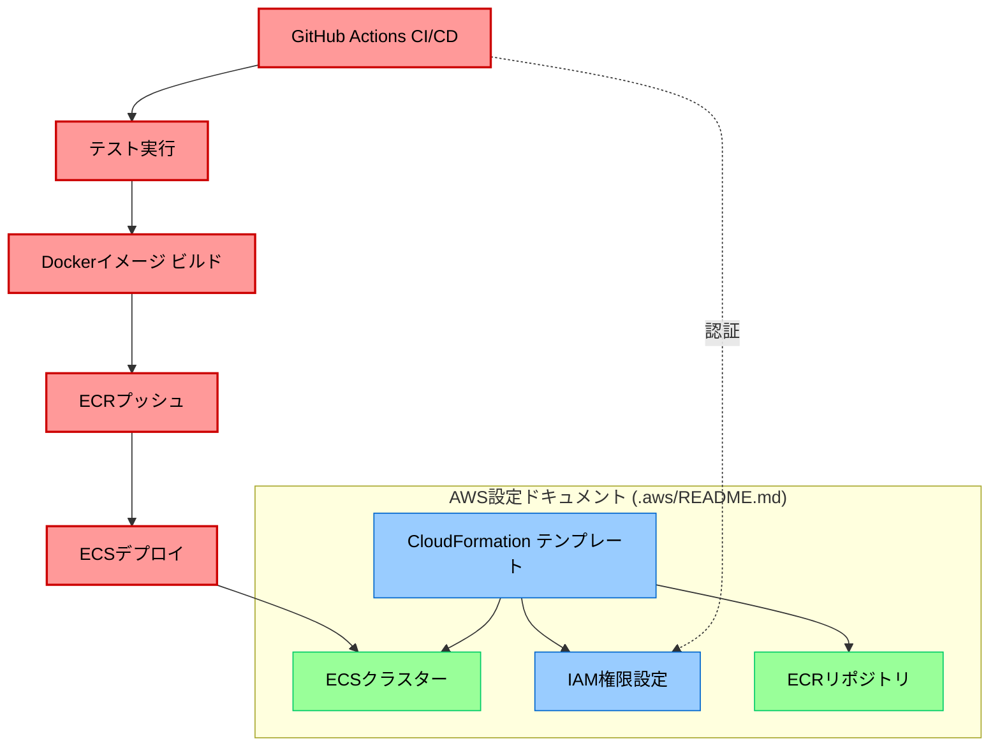

# 開発環境ガイド

このドキュメントでは、本プロジェクトの開発環境や開発フローについて説明します。

## 目次

1. [開発環境のセットアップ](#開発環境のセットアップ)
2. [コーディング規約](#コーディング規約)
3. [品質管理ツール](#品質管理ツール)
4. [Git ワークフロー](#git-ワークフロー)
5. [テスト](#テスト)
6. [CI/CD](#cicd)

## 開発環境のセットアップ

基本的なセットアップ手順は [README.md](./README.md) を参照してください。ここでは追加の開発環境設定について説明します。

### エディタの設定

VSCode または VSCode 互換エディタ（Cursor, JetBrains Fleet など）の使用を推奨します。
プロジェクトには以下のエディタ設定が含まれています：

- `.editorconfig` - 基本的なエディタ設定（インデント、改行など）
- `.vscode/settings.json` - VSCode 向けの設定
- `.vscode/extensions.json` - 推奨拡張機能リスト

**推奨拡張機能:**

VSCode で開発する場合、プロジェクトを開くと推奨拡張機能のインストールが促されます。主な拡張機能は以下のとおりです：

- ESLint - JavaScript/TypeScript のコード品質チェック
- Prettier - コードフォーマッター
- Volar - Vue 3 のサポート
- Intelephense - PHP のサポート
- Laravel Extra Intellisense - Laravel のサポート
- EditorConfig - エディタ設定の共有

### 自動フォーマット設定

ファイル保存時に自動的にコードがフォーマットされるよう設定されています。
これは VSCode の設定（`.vscode/settings.json`）によって有効になっています。

```json
"editor.formatOnSave": true,
"editor.codeActionsOnSave": {
  "source.fixAll.eslint": true
}
```

この自動フォーマット機能により、チーム全体で一貫したコードスタイルを維持できます。

## コーディング規約

### フロントエンド (JavaScript/TypeScript/Vue)

- **フォーマットルール:** Prettier による自動フォーマット
  - セミコロンなし
  - シングルクォート
  - インデント: 2 スペース
  - 最大行長: 120 文字
  - 末尾カンマ: 可能な場所すべてに付ける
- **ESLint ルール:**
  - Vue 3 の推奨ルールセット
  - Nuxt の推奨ルールセット
  - TypeScript サポート

### バックエンド (PHP/Laravel)

- **PSR-12 準拠:** PHP_CodeSniffer によるチェック
  - インデント: 4 スペース
  - クラス名: StudlyCaps
  - メソッド名: camelCase
- **PHPStan/Larastan（レベル 5）:** 静的解析ツールによる型チェックと潜在的な問題の検出

## 品質管理ツール

### コマンドラインでの実行

**フロントエンド:**

```bash
# コード品質チェック
cd frontend && npm run lint

# コード品質チェックと自動修正
cd frontend && npm run lint:fix

# テスト実行
cd frontend && npm test

# テストカバレッジ確認
cd frontend && npm run test:coverage
```

**バックエンド:**

```bash
# コード品質チェック
cd backend && composer lint

# 静的解析
cd backend && composer analyze

# テスト実行
cd backend && composer test
```

### 自動実行ツール

**エディタ内での自動実行:**

- **保存時の自動フォーマット**: VSCode（または互換エディタ）でファイルを保存すると、Prettier（JS/TS/Vue）または PHP-CS-Fixer（PHP）によって自動的にフォーマットされます。
- **問題のリアルタイム表示**: ESLint と PHPStan/Larastan の警告・エラーがエディタ内にリアルタイムで表示されます。

**注意**: 自動フォーマットが機能するには、必要な拡張機能がインストールされていることを確認してください。

### Git フック

コミットやプッシュの前に自動的に品質チェックが行われます：

- **pre-commit:** `lint-staged` によるコミット対象ファイルのチェック
  - JavaScript ファイル: ESLint チェックと Prettier フォーマット
  - PHP ファイル: PHP_CodeSniffer チェック
- **pre-push:** フロントエンドとバックエンドのテスト実行

これらのフックは、不具合を含むコードがリポジトリに含まれるのを防ぎます。

## Git ワークフロー

Git ワークフローの詳細については [README.md](./README.md#git-ワークフロー) を参照してください。

## テスト

### フロントエンド

- **テストフレームワーク:** Vitest
- **テストファイル配置:** `frontend/test/` ディレクトリ
- **コンポーネントテスト:** `@vue/test-utils` を使用
- **実行方法:**
  - 手動実行: `cd frontend && npm run test`
  - CI 環境: GitHub Actions でプッシュ時に自動実行
  - プレプッシュフック: 変更がプッシュされる前に自動実行

### バックエンド

- **テストフレームワーク:** PHPUnit
- **テストファイル配置:** `backend/tests/` ディレクトリ
- **データベーステスト:** SQLite メモリデータベースを使用
- **実行方法:**
  - 手動実行: `cd backend && php artisan test`
  - CI 環境: GitHub Actions でプッシュ時に自動実行
  - プレプッシュフック: 変更がプッシュされる前に自動実行

## CI/CD

GitHub Actions を使用して以下の CI/CD を実施しています：

### CI (`.github/workflows/ci.yml`)

以下のイベントで実行されます：

- `main`および`develop`ブランチへのプッシュ
- プルリクエストの作成と更新

実行内容：

- コードスタイルチェック（ESLint, PHP_CodeSniffer）
- 静的解析（PHPStan/Larastan）
- テスト実行（バックエンド、フロントエンド）
- 依存パッケージの脆弱性チェック

### CD (`.github/workflows/deploy-ecs-production.yml`)

本番環境へのデプロイは、GitHub Actions を使用した自動 CI/CD パイプラインで実行されます。

- **トリガー:** `main`ブランチへのプッシュ
- **認証方法:** AWS IAM ロールベース認証（OIDC）または長期アクセスキー
- **実行内容:**
  1. テストの実行と品質チェック
  2. Docker イメージのビルド
  3. ECR へのイメージプッシュ
  4. ECS タスク定義とサービスの更新
  5. ゼロダウンタイムデプロイの実施

本番環境デプロイの詳細（AWS 環境構成、IAM 設定、必要な GitHub Secrets、CloudFormation テンプレート）については、[AWS README](./.aws/README.md)を参照してください。

### CI/CD とインフラのドキュメント関係


