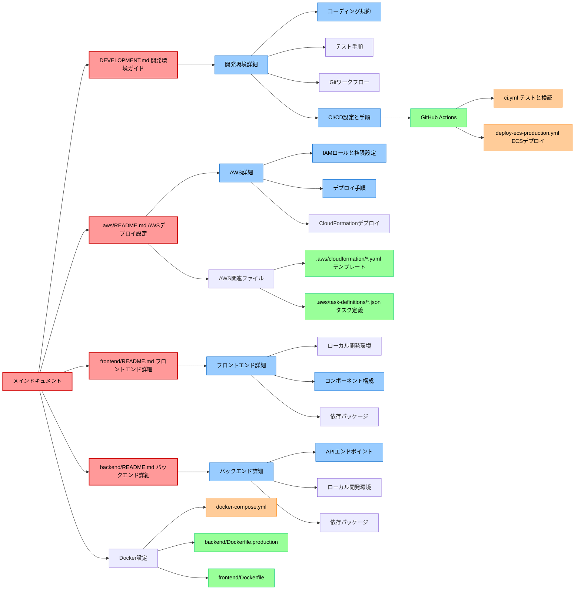

# 書籍管理システム

Laravel 12.x + Nuxt.js 3.16 + PostgreSQL 16.x を使用した書籍管理システムです。

## プロジェクト構成

プロジェクトの詳細情報は以下のドキュメントを参照してください：

- [バックエンド README](./backend/README.md) - Laravel バックエンドの詳細情報
- [フロントエンド README](./frontend/README.md) - Nuxt.js フロントエンドの詳細情報
- [AWS デプロイ設定](./.aws/README.md) - AWS ECS デプロイの設定と手順
- [開発環境ガイド](./DEVELOPMENT.md) - 開発環境のセットアップと規約

### ドキュメント構成図



## 開発環境のセットアップ

### 前提条件

- Docker Desktop がインストールされていること
- Node.js 18.0 以上がインストールされていること
- Git がインストールされていること
- Composer がインストールされていること（オプション、Docker 内で実行も可）

### 推奨エディタとプラグイン

本プロジェクトは Visual Studio Code（VSCode）または互換エディタ（Cursor, Windsurf など）での開発を推奨しています。プロジェクトには `.vscode` ディレクトリが含まれており、推奨設定と拡張機能が定義されています。

#### 必須拡張機能

プロジェクトディレクトリを VSCode で開くと、推奨拡張機能のインストールが提案されます。以下の拡張機能は開発効率と品質を向上させるために重要です：

- **ESLint** - JavaScript/TypeScript コードの静的解析
- **Prettier** - コードフォーマッター
- **Volar** - Vue 3 のシンタックスハイライトと補完
- **PHP CS Fixer** - PHP コードの自動整形
- **PHP Intelephense** - PHP の高度な補完と検証
- **Laravel Extra Intellisense** - Laravel フレームワーク用の補完機能
- **EditorConfig** - エディタの共通設定
- **YAML** - YAML ファイルの編集サポート
- **Docker** - Docker 関連ファイルの編集サポート

VSCode を使用していない場合は、同等の機能を持つエディタプラグインをインストールしてください。

### ポート設定

| サービス               | ポート |
| ---------------------- | ------ |
| Laravel バックエンド   | 8000   |
| Nuxt.js フロントエンド | 3000   |
| PostgreSQL             | 5432   |
| pgAdmin                | 5050   |

## Docker 環境の起動方法

本プロジェクトでは 2 つの Docker Compose 設定があります：

1. **プロジェクトルートの`docker-compose.yml`**：

   - フロントエンド、バックエンド、データベースを一括で起動
   - 開発環境全体の構築に使用

2. **`backend/docker-compose.yml`**：
   - バックエンドのみ（Laravel + PostgreSQL）を起動
   - バックエンド単体の開発に使用

### 重要: 同時に両方の環境を起動しないでください

これらの設定には同じポートを使用するサービスが含まれるため、**どちらか一方のみを起動**してください。
両方を同時に起動するとポート競合が発生します。

### 正しい起動方法

```bash
# 全体環境を起動する場合
docker compose up -d

# または、バックエンドのみを起動する場合
cd backend
docker compose up -d
```

### 正しい停止方法

```bash
# 起動したのと同じディレクトリで停止する
docker compose down
```

既存の環境をすべて停止するには：

```bash
# 既存のコンテナをすべて確認
docker ps -a

# 特定のコンテナを停止・削除
docker stop [コンテナID] && docker rm [コンテナID]
```

## 開発サーバーの起動

### Docker を使用した起動（推奨）

1. Docker Desktop を起動します
2. 以下のコマンドを実行します：

```bash
docker compose up -d --build
```

### 個別の起動方法

#### バックエンド（Laravel）の起動

```bash
cd backend
php artisan serve
```

#### フロントエンド（Nuxt.js）の起動

```bash
cd frontend
npm run dev
```

## コード品質管理とテスト

### Linter と Formatter

本プロジェクトでは以下の Linter と Formatter を使用しています：

#### バックエンド

- **PHP_CodeSniffer (PSR-12)** - コーディング規約チェック
- **PHPStan/Larastan** - 静的解析
- **PHP-CS-Fixer** - コードスタイル自動修正

コマンドラインで実行：

```bash
cd backend
composer lint    # PHPCSによるコード規約チェック
composer analyze # PHPStanによる静的解析
./vendor/bin/php-cs-fixer fix # コードスタイル自動修正
```

#### フロントエンド

- **ESLint** - コード品質チェック
- **Prettier** - コードフォーマッター

コマンドラインで実行：

```bash
cd frontend
npm run lint     # リントチェック
npm run lint:fix # リントとフォーマット修正
```

#### 開発プロセスの自動化

本プロジェクトでは、コード品質を維持するために以下の自動化が設定されています：

- **Git Hooks（Husky）** - コミット前にコード品質チェックを自動実行
- **lint-staged** - 変更されたファイルのみをリントして効率化

コミット前には以下が自動実行されます：

1. フロントエンド: 変更された JavaScript/TypeScript ファイルの ESLint と Prettier チェック
2. バックエンド: 変更された PHP ファイルの PHP-CS-Fixer と PHPCS チェック

**自動フォーマット**: VSCode (または互換エディタ) を使用している場合、ファイル保存時に自動フォーマットが適用されます。プロジェクトには`.vscode/settings.json`があらかじめ設定されており、保存時に以下のファイル形式が自動的にフォーマットされます：

- JavaScript/TypeScript/Vue (Prettier)
- PHP (PHP CS Fixer)
- HTML/CSS/SCSS (Prettier)
- JSON/YAML (Prettier/YAML)
- Markdown (Prettier)
- Dockerfile (Docker)
- シェルスクリプト/dotenv (Shell Format)

### テスト実行

#### バックエンド

```bash
cd backend
php artisan test  # すべてのテストを実行
```

#### フロントエンド

```bash
cd frontend
npm run test  # すべてのテストを実行
```

## Git ワークフロー

本プロジェクトでは以下のようなシンプルな Git ワークフローを採用しています：

### ブランチ戦略

- **`main`**: 本番環境用のブランチ。常に安定した状態を維持する。
- **`develop`**: （オプション）開発環境用のブランチ。ECS 検証環境がある場合に使用。

### 開発プロセス

1. **機能開発・バグ修正**:

   - 新機能開発は `feature/機能名` ブランチ（例：`feature/barcode-generator`）
   - バグ修正は `fix/修正内容` ブランチ（例：`fix/login-error`）
   - 基本的に`main`から分岐し、プルリクエスト後に`main`へマージ

2. **コミットメッセージ規約**:

   ```
   タイプ: 簡潔な説明

   詳細な説明（オプション）

   関連する問題やPR（オプション）
   ```

   **タイプ例:**

   - `feat`: 新機能
   - `fix`: バグ修正
   - `docs`: ドキュメント変更
   - `style`: フォーマットの変更
   - `refactor`: リファクタリング
   - `test`: テスト関連の変更
   - `chore`: その他の変更

## テストユーザー

- メールアドレス: test@example.com
- パスワード: password

## CI/CD 環境

プロジェクトには以下の CI/CD 設定が含まれています：

- **CI** (`.github/workflows/ci.yml`): コードプッシュ時に自動的に Lint とテストを実行
- **プロダクションデプロイ** (`.github/workflows/deploy-ecs-production.yml`): `main`ブランチへのプッシュ時に AWS ECS へ自動デプロイ

### テスト自動化

- プルリクエスト時: 自動的に CI ワークフローが実行され、コード品質とテストをチェック
- プロダクションデプロイ前: テストが自動的に実行され、成功した場合のみデプロイが行われる

## 開発者向けドキュメント

開発を始める前に、以下のドキュメントを確認してください：

- [開発環境ガイド](./DEVELOPMENT.md) - コーディング規約、品質管理ツール、Git ワークフロー

## 本番環境へのデプロイ

本プロジェクトは AWS ECS を使用して本番環境にデプロイします。

デプロイの詳細な手順や AWS 環境の設定については、以下のドキュメントを参照してください：

- [AWS デプロイ設定](./.aws/README.md) - CloudFormation テンプレート、IAM 設定、デプロイコマンドなど

### デプロイ概要

1. **CI/CD パイプライン**: GitHub Actions を使用して`main`ブランチへのプッシュ時に自動デプロイ
2. **コンテナ化**: バックエンドとフロントエンドは別々の Docker コンテナとしてデプロイ
3. **インフラストラクチャ**: CloudFormation を使用して AWS リソースをコードとして管理

詳細な AWS 環境設定、IAM 権限、デプロイコマンド、トラブルシューティング手順については[AWS デプロイ設定](./.aws/README.md)を参照してください。
